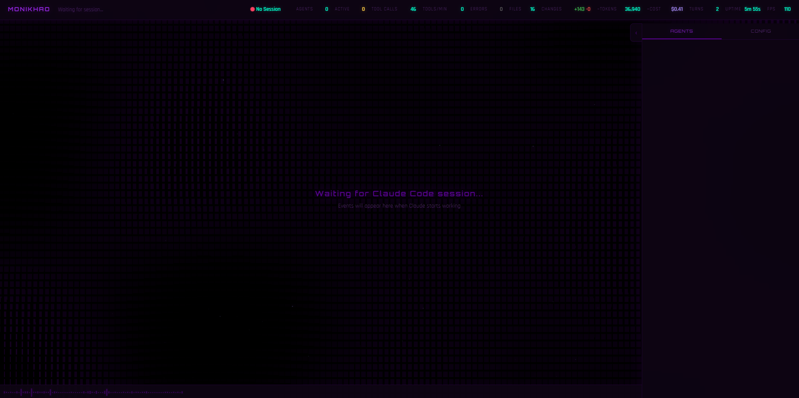

# Monikhao

Real-time 3D dashboard that visualizes AI coding agent sessions using Three.js. Works with **Claude Code** and **OpenCode** simultaneously.

Agents appear as glowing orbs with orbital particles, subagent trees, heartbeat pulses, and proximity wires — all rendered in-browser with zero build step.




## Quick Start

### Claude Code

```bash
git clone https://github.com/khaodius/monikhao.git ~/Monikhao
cd ~/Monikhao && npm install
node scripts/kmoni-ctl.cjs install
```

The install command sets up everything: copies scripts to the Claude Code plugin cache, registers the plugin, and enables it. Restart Claude Code after install.

Start any Claude Code session — the worker auto-spawns and the dashboard is live at `http://127.0.0.1:37800`.

### OpenCode

```bash
git clone https://github.com/khaodius/monikhao.git ~/Monikhao
cd ~/Monikhao && npm install
```

Copy `monikhao.js` to `~/.config/opencode/plugins/` and symlink the repo:

```bash
# macOS/Linux
cp monikhao.js ~/.config/opencode/plugins/
ln -s "$(pwd)" ~/.config/opencode/plugins/Monikhao

# Windows (admin PowerShell)
Copy-Item monikhao.js "$env:USERPROFILE\.config\opencode\plugins\"
New-Item -ItemType Junction -Path "$env:USERPROFILE\.config\opencode\plugins\Monikhao" -Target "$(Get-Location)"
```

Restart OpenCode. The worker auto-spawns on first session.

### Manual (standalone)

```bash
node scripts/worker-service.cjs
# Open http://127.0.0.1:37800
```

## Commands

| Command | Description |
|---------|-------------|
| `/kmoni-on` | Start the worker |
| `/kmoni-off` | Disconnect your platform (shuts down worker only if no other platform is connected) |
| `/kmoni-status` | Show worker health and active sessions |
| `/kmoni-install` | Full setup wizard (deps, plugin registration, cache sync) |

Commands execute programmatically — no AI interpretation. In Claude Code they're intercepted by a `UserPromptSubmit` hook; in OpenCode by `tui.command.execute`. Both call `scripts/kmoni-ctl.cjs` directly.

## Features

### 3D Visualization
- **Multi-platform** — Claude Code and OpenCode sessions side-by-side on one dashboard
- **3D agents** — Glowing orbs with orbital particles, rings, and heartbeat breathing
- **Subagent trees** — Child agents orbit parents with energy flow connections
- **3D parallax camera** — Background scrolls with camera rotation for depth
- **Proximity wires** — Orbital particles draw fading connections when nearby
- **12 canvas backgrounds** — waves, plasma, fire, topology, fractal, snow, moire, and more

### Live Tracking
- **Tool tracking** — Color-coded particles and thought bubbles per tool call
- **Tool breakdown** — Per-tool call counts with error tracking in the agents panel
- **Error detection** — Red orb flash on errors, error-highlighted feed events, per-agent error badges
- **Permission alerts** — Orb pulses amber with "AWAITING" label when the agent needs user approval
- **Model detection** — Auto-detects model (Opus 4.6, Sonnet 4.5, GPT-5, etc.) with mid-session switching
- **Cost estimation** — Real-time token counting with model-based pricing

### Dashboard
- **Session history** — History tab with completed session summaries (date, duration, model, stats)
- **Session export** — Download full session data as formatted JSON
- **Event search** — Filter events across all agents by text match
- **Keyboard shortcuts** — `1`/`2`/`3` switch tabs, `P` panel, `F` fps, `G` grid, `L` labels, `R` rotate, `M` mute
- **Draggable agents** — Reorder agent panels and session groups via drag and drop
- **7 color themes** — purple, cyan, emerald, rose, amber, crimson, plus custom hex
- **Ambient audio** — Synthesized soundscape with tool-specific tones

### Reliability
- **Smart disconnect** — `/kmoni-off` only kills the worker when no other platform is connected
- **Session cleanup** — Stale and ghost sessions auto-pruned after 5 minutes
- **WebSocket backpressure** — Slow clients skipped to prevent memory buildup
- **FPS stability** — Physics dt clamping prevents cascade dips under heavy load

## Architecture

```
Monikhao/
├── hooks/hooks.json              # Claude Code hook definitions
├── scripts/
│   ├── worker-service.cjs        # Express + WebSocket server (port 37800)
│   ├── kmoni-ctl.cjs             # CLI: on/off/status/install
│   ├── prompt-hook.cjs           # Claude Code /kmoni-* command interceptor
│   ├── session-start-hook.cjs    # Claude Code session lifecycle
│   ├── session-stop-hook.cjs     # Claude Code session end
│   ├── event-hook.cjs            # Claude Code tool event forwarding
│   └── notification-hook.cjs     # Claude Code response text capture
├── web/
│   ├── index.html                # Dashboard HTML
│   ├── app.js                    # Three.js scene + WebSocket client
│   └── style.css                 # Dashboard styles
├── monikhao.js                   # OpenCode plugin entry point
├── config.json                   # Runtime configuration
└── package.json                  # Dependencies (express, ws)
```

**Event flow:** Platform hooks capture tool/session events, POST them to the worker, which broadcasts via WebSocket to connected browser clients that render the 3D scene.

Both platforms share one worker on port 37800. Whichever starts first spawns it; the other connects via health check.

## Configuration

Edit `config.json` directly or use the dashboard Config tab (changes save automatically).

| Category | Key Settings |
|----------|-------------|
| Theme | `display.theme` (purple/cyan/emerald/rose/amber/crimson/custom), `display.customColor` |
| Animation | `animation.speed`, `animation.autoRotate`, `animation.maxFps` |
| Display | `display.showLabels`, `display.autoFocus`, `display.bgType`, `display.bgOpacity` |
| Audio | `features.ambientAudio`, `features.audioVolume` |

**Background types:** waves, plasma, fire, topology, ripples, fractal, lissajous, snow, hyperbolic, spiral, moire, flow

**Keyboard shortcuts:**

| Key | Action |
|-----|--------|
| `1` | Agents tab |
| `2` | History tab |
| `3` | Config tab |
| `P` | Toggle side panel |
| `F` | Toggle FPS counter |
| `G` | Toggle grid |
| `L` | Toggle labels |
| `R` | Toggle auto-rotate |
| `M` | Toggle audio |

**Environment variables:** `AGENT_MONITOR_PORT` (default 37800), `MONIKHAO_ROOT`, `MONIKHAO_PATH`

## API

| Method | Path | Description |
|--------|------|-------------|
| GET | `/` | Dashboard |
| GET | `/api/health` | Health check |
| GET | `/api/state` | Full state (sessions, agents, timeline) |
| GET | `/api/config` | Current configuration |
| GET | `/api/history` | Completed session history |
| GET | `/api/export` | Download session data as JSON |
| GET | `/api/sessions/sources` | Active session sources |
| POST | `/api/events` | Ingest event |
| POST | `/api/config` | Update configuration |
| POST | `/api/admin/disconnect?source=X` | Remove sessions from a source |
| POST | `/api/admin/shutdown` | Shut down worker |
| WS | `/` | Real-time state updates |

## Requirements

- Node.js >= 18
- npm (for installing express and ws)
- Claude Code and/or OpenCode

## License

MIT
